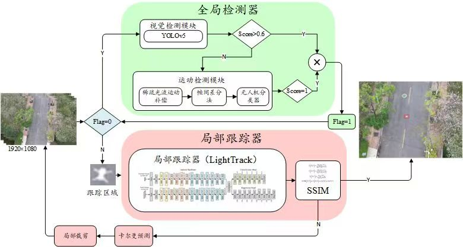
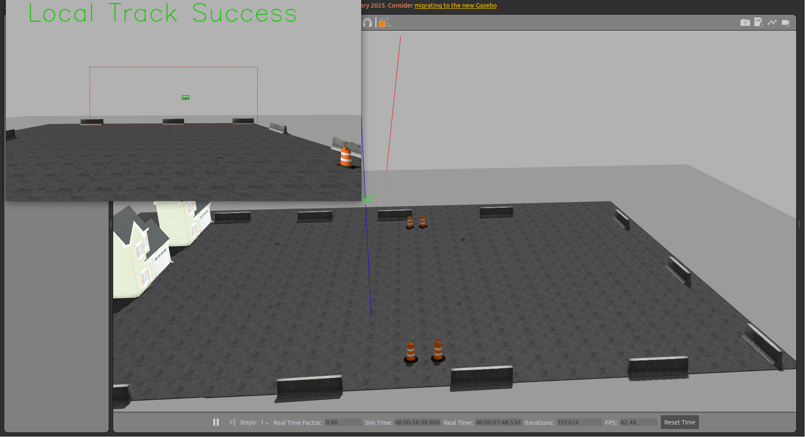

# Autonomous-Intercept-Drone
An Autonomous Intercept Drone with Image-based Visual Servo.


## 小目标无人机检测框架



## 无人机拦截方案框架
待补充

## 仿真视频以及效果图
https://www.bilibili.com/video/BV1M8QVYHE39/?spm_id_from=333.1387.homepage.video_card.click


## 仿真环境

编译PX4命令获取两架iris模型无人机和深度相机无人机
```bash
./Tools/simulation/gazebo-classic/sitl_multiple_run.sh -s "iris_depth_camera:1, iris:1"

```
**UDP**通信
```bash
MicroXRCEAgent udp4 -p 8888
```

单台无人机仿真(测试使用)
```bash
make px4_sitl gazebo-classic
```


## 如何使用Vscode进行Debug

Once you have your C++ code correctly implemented (at least compile), the First thing to do is to **compile the package exporting the symbols** (allow the breakpoints where you want to stop the code):

```sh
 - cd ros_ws
 - colcon build --symlink-install --cmake-args -DCMAKE_BUILD_TYPE=RelWithDebInfo
 - source install/setup.bash
```

Second, we have to **launch the [GDB](https://en.wikipedia.org/wiki/GNU_Debugger) Server** for debbuging the CPP Code. Here, we will use a localhost:port for creating the server. Choose any free port that you want.

```sh
ros2 run --prefix 'gdbserver localhost:3000' package_name executable_name
```

Third, we have to **create a launch.json on VSCode**. In other words, we will create a custom debugging configuration. In our case, create a GDB client and connect to the server.

    1) Open VSCode on your workspace.
    2) Go to your side bar, 'Run and Debug' section.
    3) Add a new configuration (Select C++ enviroment or any other)
    4) On your launch.json file, put the following information

Launch.json file:

```json
    {
        "version": "0.2.0",
        "configurations": [
            {
                "name": "C++ Debugger",
                "request": "launch",
                "type": "cppdbg",
                "miDebuggerServerAddress": "localhost:3000",
                "cwd": "/",
                "program": "[build-path-executable]"
            }
        ]
    }
```

 - __name__ - Custom name of your debugger configuration
 - __request__ - In this case we want to _launch_ the client
 - __type__ - _cppdbg_ for c++ debugging
 - __miDebuggerServerAddress__ - path_server:port
 - __cwd__ - Where to find all the required files. We use root because ROS, the package, and other required files are distributed along the entire PC.
 - __program__ - Change [build-path-executable] by your executable build file. You can find this path on the console when you launch the server.

